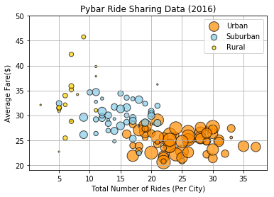
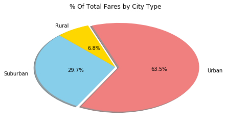
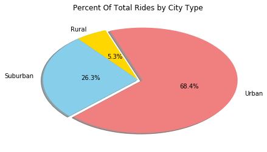
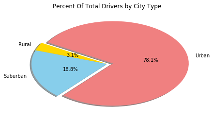

```python
import os
import pandas as pd
import matplotlib.pyplot as plt
import numpy as np

```


```python
# read csv files for city and ride data
city_file=os.path.join("Pyber","generated_data","city_data.csv")
ride_file=os.path.join("Pyber","generated_data","ride_data.csv")
city_df=pd.read_csv(city_file)
ride_df=pd.read_csv(ride_file)
# merge data based on city 
merged_data=ride_df.merge(city_df,how="inner", on= "city")
merged_data.head()
```


<div>
<style>
    .dataframe thead tr:only-child th {
        text-align: right;
    }

    .dataframe thead th {
        text-align: left;
    }

    .dataframe tbody tr th {
        vertical-align: top;
    }
</style>
<table border="1" class="dataframe">
  <thead>
    <tr style="text-align: right;">
      <th></th>
      <th>city</th>
      <th>date</th>
      <th>fare</th>
      <th>ride_id</th>
      <th>driver_count</th>
      <th>type</th>
    </tr>
  </thead>
  <tbody>
    <tr>
      <th>0</th>
      <td>Karenfurt</td>
      <td>2017-01-01 19:03:03</td>
      <td>32.90</td>
      <td>3383346995405</td>
      <td>19</td>
      <td>Urban</td>
    </tr>
    <tr>
      <th>1</th>
      <td>Karenfurt</td>
      <td>2017-01-01 05:30:46</td>
      <td>22.47</td>
      <td>18848561829</td>
      <td>19</td>
      <td>Urban</td>
    </tr>
    <tr>
      <th>2</th>
      <td>Karenfurt</td>
      <td>2017-01-02 21:58:48</td>
      <td>4.73</td>
      <td>7929949609958</td>
      <td>19</td>
      <td>Urban</td>
    </tr>
    <tr>
      <th>3</th>
      <td>Karenfurt</td>
      <td>2017-01-01 03:36:42</td>
      <td>21.65</td>
      <td>2940464578531</td>
      <td>19</td>
      <td>Urban</td>
    </tr>
    <tr>
      <th>4</th>
      <td>Karenfurt</td>
      <td>2017-01-03 04:34:51</td>
      <td>34.87</td>
      <td>2170143080929</td>
      <td>19</td>
      <td>Urban</td>
    </tr>
  </tbody>
</table>
</div>


```python
#bubble plot number of rides per city 
ride_average_merged_data=merged_data.groupby(["city","type"]).mean()

del ride_average_merged_data["ride_id"]
del ride_average_merged_data["driver_count"]
ride_average_merged_data=ride_average_merged_data.reset_index()
ride_average_merged_data=ride_average_merged_data.merge(city_df, how="right", on="city")
del ride_average_merged_data["type_y"]
ride_average_merged_data=ride_average_merged_data.rename(columns={"type_x":"type"})
ride_average_merged_data=ride_average_merged_data.set_index("city","type")
ride_average_merged_data.head()
```


<div>
<style>
    .dataframe thead tr:only-child th {
        text-align: right;
    }

    .dataframe thead th {
        text-align: left;
    }

    .dataframe tbody tr th {
        vertical-align: top;
    }
</style>
<table border="1" class="dataframe">
  <thead>
    <tr style="text-align: right;">
      <th></th>
      <th>type</th>
      <th>fare</th>
      <th>driver_count</th>
    </tr>
    <tr>
      <th>city</th>
      <th></th>
      <th></th>
      <th></th>
    </tr>
  </thead>
  <tbody>
    <tr>
      <th>Adamschester</th>
      <td>Suburban</td>
      <td>29.594444</td>
      <td>27</td>
    </tr>
    <tr>
      <th>Alexisfort</th>
      <td>Urban</td>
      <td>27.366970</td>
      <td>24</td>
    </tr>
    <tr>
      <th>Amberberg</th>
      <td>Suburban</td>
      <td>28.624375</td>
      <td>13</td>
    </tr>
    <tr>
      <th>Anthonyfurt</th>
      <td>Suburban</td>
      <td>29.491176</td>
      <td>17</td>
    </tr>
    <tr>
      <th>Boyleberg</th>
      <td>Suburban</td>
      <td>32.396000</td>
      <td>13</td>
    </tr>
  </tbody>
</table>
</div>


```python
#get number of rides per city and add to data frame ride_average_merged_data
total_number_rides_city=merged_data["city"].value_counts()
# turn value count series into data frame and name columns correctly
total_number_rides_city_df=total_number_rides_city.to_frame()
total_number_rides_city_df=total_number_rides_city_df.reset_index()
total_number_rides_city_df=total_number_rides_city_df.rename(columns={"city":"Total_Rides","index":"city"})
#get total ride data  
ride_average_merged_data=ride_average_merged_data.reset_index()
ride_average_total_ride_df=ride_average_merged_data.merge(total_number_rides_city_df, on="city", how="inner")
ride_average_total_ride_plot=ride_average_total_ride_df
#locate data for each city type using .loc
Urban=ride_average_total_ride_plot.loc[(ride_average_total_ride_plot["type"]=="Urban")&(ride_average_total_ride_plot["city"])]
Suburban=ride_average_total_ride_plot.loc[(ride_average_total_ride_plot["type"]=="Suburban")&(ride_average_total_ride_plot["city"])]
Rural=ride_average_total_ride_plot.loc[(ride_average_total_ride_plot["type"]=="Rural")&(ride_average_total_ride_plot["city"])]
#plot the data on scatter plot
plt.scatter(Urban["Total_Rides"],Urban["fare"],s=Urban["driver_count"]*5,c="darkorange",alpha=0.7,edgecolors="black", label="Urban")
plt.scatter(Suburban["Total_Rides"],Suburban["fare"],s=Suburban["driver_count"]*5,c="skyblue",alpha=0.7,edgecolors="black", label="Suburban")
plt.scatter(Rural["Total_Rides"],Rural["fare"],s=Rural["driver_count"]*5,c="gold",alpha=0.7,edgecolors="black", label="Rural")
plt.title("Pybar Ride Sharing Data (2016)")
plt.ylabel("Average Fare($)")
plt.xlabel("Total Number of Rides (Per City)")
plt.ylim(19,50)
plt.legend()
plt.grid()
plt.show()
```





#Size of points in scatter plot(Pybar Ride Sharing Data(2016)) are related to number of drives in per city


```python

# % of total fares per city type, get data
city_sum_merged_data=merged_data.groupby(["type"]).sum()
del city_sum_merged_data["driver_count"]
del city_sum_merged_data["ride_id"]

total_fares=round(city_sum_merged_data["fare"].sum(),2)
city_sum_merged_data["% Of Total Fares"]=round((city_sum_merged_data["fare"]/total_fares*100),2)
del city_sum_merged_data["fare"]
#plot data on pie graph
colors=np.where(city_sum_merged_data.index=="Urban","lightcoral","-")
colors[city_sum_merged_data.index=="Suburban"]="skyblue"
colors[city_sum_merged_data.index=="Rural"]="gold"
explode=(0,0,0.05)
city_sum_merged_data.plot(kind="pie", y="% Of Total Fares", figsize=(7,4), colors=colors,
                          explode=explode,pctdistance=0.5,startangle=110,
                          autopct='%1.1f%%', shadow=True, legend=False)
plt.title("% Of Total Fares by City Type")
plt.ylabel("")                       
plt.show()


```





```python
#% total rides on city type
total_rides_type_df=ride_average_total_ride_df.groupby(["type"]).sum()
del total_rides_type_df["driver_count"]

del total_rides_type_df["fare"]
total_rides_all_type=total_rides_type_df["Total_Rides"].sum()
total_rides_type_df["% Of Rides"]=round(total_rides_type_df["Total_Rides"]/total_rides_all_type*100,1)
colors=np.where(total_rides_type_df.index=="Urban","lightcoral","-")
colors[total_rides_type_df.index=="Suburban"]="skyblue"
colors[total_rides_type_df.index=="Rural"]="gold"
explode=(0,0,0.05)
total_rides_type_df.plot(kind="pie", y="% Of Rides", figsize=(7,4), colors=colors,
                          explode=explode,pctdistance=0.5,startangle=110, 
                         autopct='%1.1f%%',shadow=True,legend=False)
plt.title("Percent Of Total Rides by City Type")
plt.ylabel("")                       
plt.show()

```





```python
#% of total drivers on city type 
total_drivers_df=ride_average_merged_data.groupby(["type"]).sum()
del total_drivers_df["fare"]
total_drivers_all_types=total_drivers_df["driver_count"].sum()
total_drivers_df["% Of Drivers"]=round(total_drivers_df["driver_count"]/total_drivers_all_types*100,2)

colors=np.where(total_drivers_df.index=="Urban","lightcoral","-")
colors[total_drivers_df.index=="Suburban"]="skyblue"
colors[total_drivers_df.index=="Rural"]="gold"
explode=(0,0,0.08)
total_drivers_df.plot(kind="pie", y="% Of Drivers", figsize=(7,4), colors=colors,
                          explode=explode,pctdistance=0.5,startangle=150,
                      autopct='%1.1f%%',shadow=True,legend=False)
plt.title("Percent Of Total Drivers by City Type")
plt.ylabel("")                       
plt.show()


```




